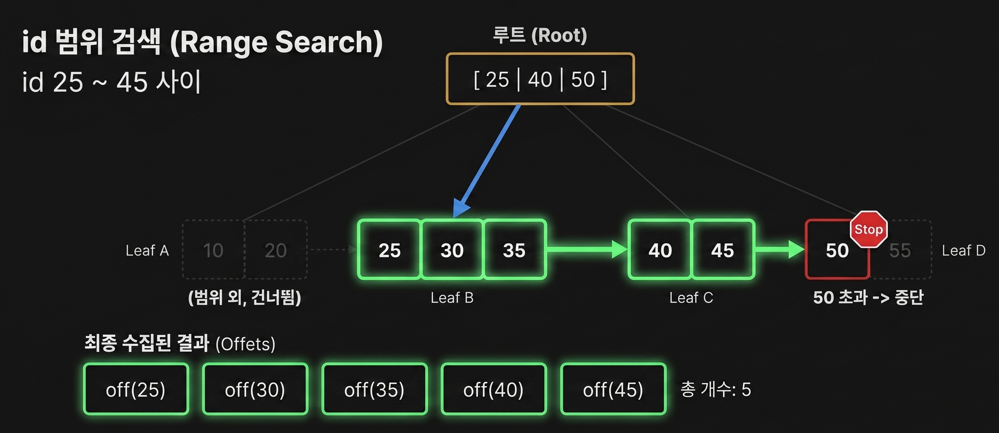

# SQL Parser with B+ Tree Index

파일 기반 SQL 처리기에 B+ 트리 인덱스를 적용해, 선형 탐색(Full Table Scan)과의 성능 차이를 비교한 프로젝트 프로젝트입니다.

---

## 1. B+ 트리 탐색 과정 및 특징

**선형 탐색**은 파일 전체를 처음부터 끝까지 읽으며 비교합니다. row 수가 커질수록 비용이 그대로 따라갑니다.

**B+ 트리**는 루트에서 리프까지 **단일 경로**만 따라 내려갑니다. 각 노드에서는 "다음에 어디로 갈지"만 고르면 되므로, 트리 높이가 낮으면 비교 횟수가 매우 적습니다.

### 1-1. 선형탐색과 B+ 트리 비교

| 항목           | 🔍 선형 탐색 (Linear Scan)     | 🌳 B+ 트리                     |
| -------------- | ------------------------------ | ------------------------------ |
| 탐색 방식      | 파일 처음부터 끝까지 순차 탐색 | 루트 → 내부 노드 → 리프 노드   |
| 접근 경로      | 전체 데이터 탐색               | 하나의 경로만 따라감           |
| 비교 횟수      | 데이터 수에 비례 (O(N))        | 트리 높이에 비례 (O(log N))    |
| 최악의 경우    | 거의 전체 파일을 읽음          | 항상 일정한 깊이만 탐색        |
| 데이터 위치    | 파일 전체에 분산               | 실제 데이터는 리프 노드에 집중 |
| 내부 노드 역할 | 없음                           | 다음으로 내려갈 child 선택     |
| 성능 특징      | 데이터 많을수록 급격히 느려짐  | 데이터 많아도 안정적인 성능    |

---

## 2. B+ 조건 BETWEEN 로직 설명

`BETWEEN` 질의는 "시작 leaf를 찾고, 그 leaf부터 오른쪽으로 필요한 범위만 훑는 방식"으로 동작합니다.



1. 트리 탐색으로 `from`이 들어갈 **시작 리프**를 찾습니다.
2. 그 리프 안에서 `from` 위치부터 순서대로 읽어 나갑니다.
3. 리프를 다 소진하면 **옆 리프로 이동**합니다 (리프끼리 linked list로 연결).
4. `to`를 넘는 key를 만나는 순간 **즉시 종료**합니다.
5. 모은 offset 배열을 실행기가 받아 실제 row를 다시 읽는 과정이 발생합니다.

### 2-1. B+ 트리에서 range 탐색이 왜 유리한가?

리프 내부는 이미 정렬되어 있고, 리프끼리 linked list로 이어져 있습니다. 그래서 범위 질의는 **처음 한 번만 트리를 탐색하고, 이후에는 리프 체인을 따라 순차적으로 훑는** 구조가 됩니다.

| 구조                        | 특징                              | 성능           |
| --------------------------- | --------------------------------- | -------------- |
| 🔍 전체 파일 (Linear Scan)  | 디스크 전체 순차 탐색             | ❌ 매우 느림   |
| 🌳 B+ 트리 (Node 내부 배열) | 작은 정렬된 배열 탐색             | ✅ 매우 빠름   |
| 🔗 연결 리스트              | 포인터 따라 이동 (랜덤 접근 불가) | ❌ 캐시 비효율 |
| 🌲 트리(포인터 기반 탐색)   | 노드 간 점프 발생                 | ⚠️ 캐시 비효율 |

```
1. Node 하나는 크기가 작아 비교 범위가 제한됨
2. 배열이라 메모리에 연속 -> CPU 캐시 히트율을 높임
3. 정렬되어 있어 이진 탐색 가능(O(log N))
```

---

## 3. 프로젝트 쟁점 포인트

### 쟁점 포인트 1 — 인덱스가 항상 최종 결과까지 빠른 것은 아니다

- raw B+ 트리 탐색은 매우 빠릅니다.
- 하지만 결과 row가 많아지면 `offset -> row 재조회` 비용이 커집니다.
- 그래서 `age BETWEEN 30 AND 50` 같은 질의에서는 full scan이 더 효율적인 구간이 나타날 수 있습니다.

### 쟁점 포인트 2 — 높이 비교를 위해 I/O 시뮬레이션을 추가했다

- 메모리에서만 보면 트리 높이 차이가 체감되기 어렵습니다.
- 그래서 노드 방문 시 랜덤 블록 읽기처럼 동작하는 시뮬레이션을 추가했습니다.
- 이 덕분에 "왜 실제 DB에서 tree height가 중요한가"를 더 현실적으로 설명할 수 있습니다.

### 쟁점 포인트 3 - 실제 높이 차이가 성능 효율에 영향을 줄까?

-

---

## 4. 역할 분담

각 역할이 독립 모듈을 맡되, 최종적으로는 하나의 SELECT 경로에서 만난다는 점을 강조하면 좋습니다.

| 역할 | 담당             | 발표에서 강조할 포인트                              |
| ---- | ---------------- | --------------------------------------------------- |
| A    | B+ Tree 알고리즘 | split, leaf linked list, range scan, tree height    |
| B    | Index Manager    | `.dat` 파일 스캔, `id/age -> offset` 인덱스 구축    |
| C    | SQL 파서 확장    | `BETWEEN` 문법과 타입 검증 추가                     |
| D    | Executor + 성능  | 인덱스 분기, `fetch_by_offset(s)`, 시간 측정과 비교 |

즉, 각 역할은 분리되어 있지만 실제 실행에서는 하나의 파이프라인으로 결합됩니다.

---

## 5. 커밋 이력으로 본 프로젝트 진화

### 5-1. 기본 구조와 협업 규칙 정리

- `203619e`: 프로젝트 초기화
- `5181916`: 인터페이스와 역할 문서 생성
- `c7d50d5`: 하네스, pre-commit hook, ownership guard, `AGENT.md` 추가

즉, 초반부터 "기능 구현"뿐 아니라 "협업 가능한 구조"를 먼저 만든 프로젝트였습니다.

### 5-2. range query에 맞게 인덱스 구조 재설계

- `a59cdcc`: Tree #2를 복합 키에서 `age` 단일 인덱스로 재설계
- `ec956f8`: executor에 `WHERE age BETWEEN` 인덱스 분기 추가

이 부분은 발표에서 "요구사항에 맞춰 구조를 바꾼 설계 판단" 사례로 쓰기 좋습니다.

### 5-3. 파서와 B+ 트리 본체 구현

- `aa1cf11`, `2645f9b`: Role C `BETWEEN` 기능 구현
- `f60c9ab`: Role A B+ 트리 구현
- `a0f5e69`: 기존 `.dat` 파일을 읽어 인덱스를 재구축하는 `index_init` 구현

즉, 문법 확장과 인덱스 구현이 병렬로 진행된 뒤 하나로 묶였습니다.

### 5-4. 실행 안정화와 성능 비교 체계 추가

- `2eb6a76`: executor 안정성 보강 및 회귀 테스트
- `a97f0b3`: 성능 비교 벤치마크 추가, 선형 조회의 `BETWEEN` 처리 지원
- `82777a5`: CLI 비교 실행과 B+ 트리 range 조회 확장

이 흐름 덕분에 발표에서 "기능 구현"에서 끝나지 않고 "비교 가능한 실험 환경"까지 만들었다는 점을 보여줄 수 있습니다.

### 5-5. 문서화와 발표 준비 단계까지 이어짐

- `d09c9fc`, `3b269e1`, `fa2125c`: 실행 흐름과 B+ 트리 설명 보강
- `2379b2e`, `74ea0a2`: 이전 SQL 처리기와 현재 프로젝트의 연속성 정리

즉, 최종 단계에서는 코드뿐 아니라 "어떻게 설명할 것인가"까지 정리하는 흐름으로 마무리되었습니다.

---

## 6. 발표 마무리

- 작은 범위의 point search / range search에서는 B+ 트리가 매우 효과적입니다.
- 하지만 결과 row가 많아지면 실제 row fetch I/O 때문에 full scan이 더 유리해질 수 있습니다.
- 이 프로젝트는 바로 그 차이를 "SQL 처리기 + 인덱스 + 비교 하네스"를 통해 보여주기 위해 설계되었습니다.

한 줄로 정리하면:

> "이 프로젝트는 B+ 트리가 빠르다는 사실만 보여주는 것이 아니라, 언제 빠르고 언제 전체 실행에서는 불리해질 수 있는지까지 보여주는 SQL 처리기 확장 실험입니다."

## 7. 프로젝트 진행하면서 어려웠던 점, 임팩트 있는 기억
